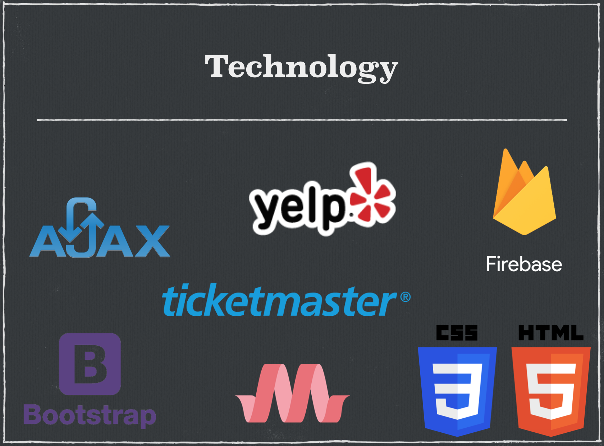

# What_Going_On_App

What's Going On is an app that lets users search for where to eat, where to drink and what is going in Nashville for any date they are visiting. 

## Getting Started

Simply select the date you are visiting on the datepicker calendar and voila - the locals guide to the best music, food, and nightlife is right at your fingertips.

## How to run the program

The application is hosted through GitHub Pages and is available at the below link.

https://bwillstorey.github.io/Whats-Going-On/

## Project Technical Specs

What's Going On utilizes the Yelp Fusion API, TicketMaster API, AJAX, Bootstrap, Materialize, Animate.css and Firebase.

## Contributers
**Zach Matthews** - HTML, CSS, Firebase \
**Cam Forrest** - Food & Restaurants API (Yelp Fusion) \
**Brian Storey** -  Events & Concerts API (TicketMaster) \
**Christian Chavez** - Bars & Nightlife API (Yelp Fusion)